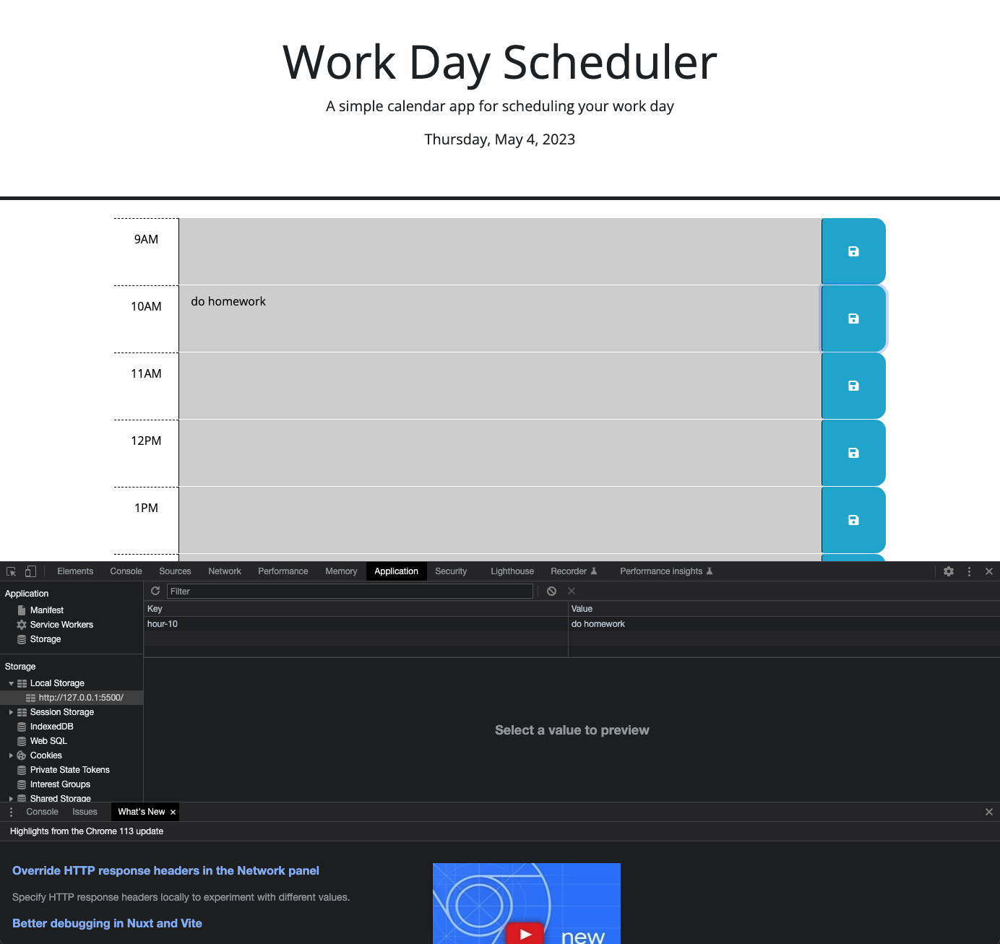
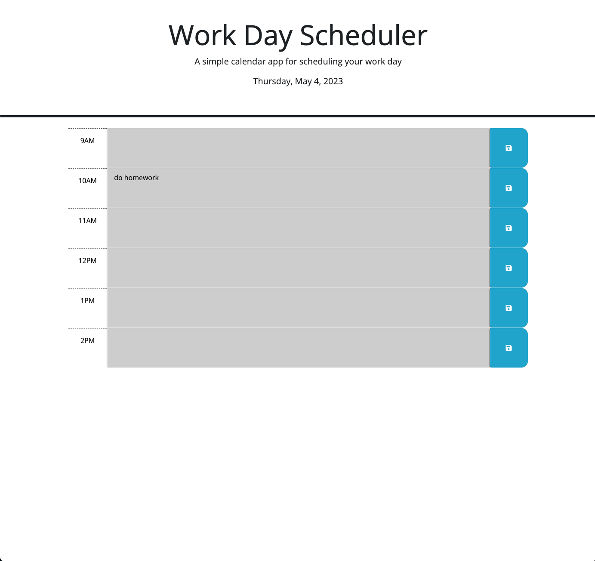

# Calendar-App

# Description

In this web app it showcases how javascript is used to save a description into the local storage,
Also it shows how the text area can chage color to either gray for past, red for present, and green for future, depeding on the time we are currrently. Also displays the current day, and year.  

# Technology Used

In this project, HTML, CSS, AND JavaScript was used to create this web app.

# Summary 

This app was built to create a calendar with things to do at a certain time. this items can be saved to the local storage, so once the person refreshes the page the item still threr. Also the text area is colerd when the item is either in the paset present or future.